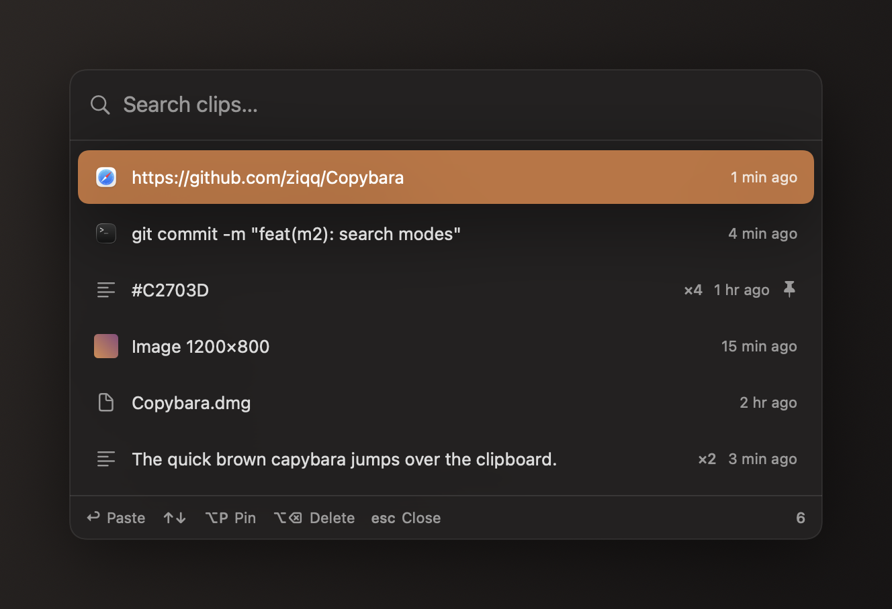

<div align="center">

# 🐹 Copybara

**A fast, keyboard-first, privacy-respecting clipboard manager for macOS.**

*Like a capybara that quietly keeps everything you copy — calm, friendly, always there.*

[](https://github.com/ziqq/Copybara/actions/workflows/ci.yml)
[](LICENSE)


<br>



</div>

---

Copybara lives in your menu bar and remembers your clipboard history. Hit a global
hotkey, type a few letters, press <kbd>Return</kbd> — it pastes straight into the app
you were working in. Everything stays local. Nothing goes to the cloud.

This is an independent, native reimagining of the idea behind
[Maccy](https://maccy.app), built from scratch in Swift/SwiftUI.

## Why

Copying things is constant. Losing what you copied ten seconds ago is annoying.
A clipboard manager should be **instant, invisible, and trustworthy** — and do
exactly one job well. That is the entire scope of Copybara.

## Principles

- **Keyboard-first** — the mouse is optional; everything works from the keyboard.
- **Local-only** — history never leaves the device; no accounts, no sync, no telemetry.
- **Lightweight** — a menu-bar agent that stays out of the way and sips resources.
- **Instant** — open and search with zero perceptible delay.

## Features

### MVP (v0.1)
- Background clipboard monitoring (text).
- Local history with a configurable size limit.
- Menu-bar icon + global hotkey to open (default <kbd>⌘</kbd><kbd>⇧</kbd><kbd>C</kbd>).
- Instant fuzzy search over history.
- Arrow-key navigation, <kbd>Return</kbd> to paste into the active app.
- Clear history; launch at login.

### v0.2 — "full Maccy parity"
- Pin favorite items.
- Images, rich text (RTF), and file references.
- Ignore passwords (`ConcealedType`), transient types, and app blocklist.
- Hover preview and a proper settings screen.
- "Show icon in: Menu bar / Dock / Both" toggle.

### Later (optional)
- Snippets/templates, auto-update (Sparkle), multiple paste formats.

## Requirements

- **macOS 12.0 (Monterey) or later.** Newer-OS APIs are adopted behind
  `if #available` checks so the app runs everywhere down to 12.
- **Accessibility permission** — required only so Copybara can paste into the
  frontmost app (it synthesizes <kbd>⌘</kbd><kbd>V</kbd>). Copybara never reads the
  screen or other apps' contents.

## Tech stack

| Concern | Choice |
|---|---|
| Language / UI | Swift + SwiftUI (AppKit for the menu bar & window) |
| App type | Menu-bar agent (`LSUIElement`), optional Dock icon |
| Architecture | **VOODO** (View · Observable Object · Data Object) for screens + a service layer |
| Persistence | Core Data (baseline for macOS 12+) |
| Clipboard | `NSPasteboard` change-count polling |
| Global hotkey | [`KeyboardShortcuts`](https://github.com/sindresorhus/KeyboardShortcuts) |
| Settings | [`Defaults`](https://github.com/sindresorhus/Defaults) |
| Paste | `CGEvent` synthesized <kbd>⌘</kbd><kbd>V</kbd> |
| Launch at login | `SMAppService` (13+) with a login-item fallback on 12 |

See [`docs/ARCHITECTURE.md`](docs/ARCHITECTURE.md) for the full design and
[`docs/CONCEPT.md`](docs/CONCEPT.md) for the product concept.

## Documentation

- [Concept](docs/CONCEPT.md) — what Copybara is and why.
- [Architecture](docs/ARCHITECTURE.md) — modules, data flow, conventions.
- [Roadmap](docs/ROADMAP.md) — milestones and scope.

## Building from source

Copybara uses [XcodeGen](https://github.com/yonaskolb/XcodeGen) to generate the
Xcode project from [`project.yml`](project.yml) (the `.xcodeproj` is not checked in).

```bash
brew install xcodegen
git clone https://github.com/ziqq/Copybara.git
cd Copybara
xcodegen generate
open Copybara.xcodeproj
```

Then pick your signing team in *Signing & Capabilities* and run. On first paste,
grant Accessibility in *System Settings → Privacy & Security → Accessibility*.

Run the tests from the command line:

```bash
xcodebuild -project Copybara.xcodeproj -scheme Copybara -destination 'platform=macOS' test
```

## Status

✅ v0.2 feature-complete — capture (text/image/RTF/files), keyboard-driven search
(fuzzy/exact/regex), paste (with a plain-text option), pin, delete, per-item
quick-paste, privacy filters + app blocklist, and clear commands. Remaining work
is polish and release (icon, onboarding, auto-update). See [`docs/ROADMAP.md`](docs/ROADMAP.md).

## Acknowledgements

Inspired by [Maccy](https://maccy.app) by Alex Rodionov. Copybara is an
independent implementation built from scratch, not a fork.

## License

[MIT](LICENSE) © 2026 Anton Ustinoff
